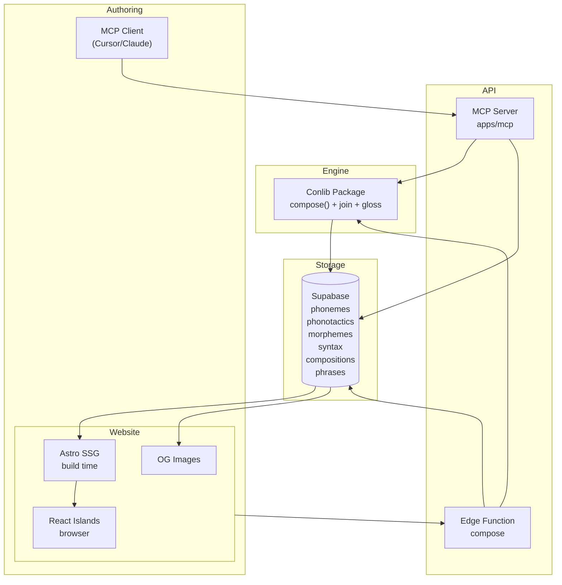

# Architecture

How the tables defined in `docs/linguistics.md` compose into a working engine. The engine's core operation is **feature unification**: it reads morpheme sequences, resolves their feature bundles, and produces surface forms, glosses, and semantic interpretations.

---

## Full schema

All tables in a single view.

```sql
-- Sound atoms
CREATE TABLE phonemes (
  id uuid PRIMARY KEY DEFAULT gen_random_uuid(),
  symbol text NOT NULL,
  ipa text NOT NULL,
  type text NOT NULL CHECK (type IN ('consonant', 'vowel', 'tone', 'diphthong')),
  place text,
  manner text,
  height text,
  backness text,
  rounded boolean DEFAULT false,
  voiced boolean DEFAULT false,
  tags text[] DEFAULT '{}',
  created_at timestamptz DEFAULT now(),
  updated_at timestamptz DEFAULT now()
);

-- Sound combination rules
CREATE TABLE phonotactics (
  id uuid PRIMARY KEY DEFAULT gen_random_uuid(),
  description text NOT NULL,
  context text NOT NULL,
  constraint text NOT NULL CHECK (constraint IN ('forbid', 'require')),
  left_tags text[] NOT NULL,
  right_tags text[] NOT NULL,
  repair text CHECK (repair IN ('epenthesis', 'deletion', 'feature_change')),
  repair_sound text,
  created_at timestamptz DEFAULT now()
);

-- Meaning atoms
CREATE TABLE morphemes (
  id uuid PRIMARY KEY DEFAULT gen_random_uuid(),
  form text NOT NULL UNIQUE,
  type text NOT NULL CHECK (type IN ('root', 'prefix', 'suffix', 'infix', 'circumfix', 'clitic', 'particle', 'suprafix')),
  gloss text NOT NULL,
  features jsonb DEFAULT '{}',
  selection jsonb DEFAULT '{}',
  tags text[] DEFAULT '{}',
  description text,
  etymology uuid[] DEFAULT '{}',
  see_also uuid[] DEFAULT '{}',
  created_at timestamptz DEFAULT now(),
  updated_at timestamptz DEFAULT now()
);

-- Constituent order
CREATE TABLE syntax (
  id uuid PRIMARY KEY DEFAULT gen_random_uuid(),
  "order" int NOT NULL,
  constituent text NOT NULL,
  role text,
  required boolean DEFAULT false,
  tags text[] DEFAULT '{}',
  created_at timestamptz DEFAULT now()
);

-- Cached composition results
CREATE TABLE compositions (
  id uuid PRIMARY KEY DEFAULT gen_random_uuid(),
  sequence_hash text UNIQUE NOT NULL,
  morpheme_ids uuid[] NOT NULL,
  surface_form text NOT NULL,
  phon text,
  gloss text NOT NULL,
  features jsonb DEFAULT '{}',
  output_category text,
  dirty boolean DEFAULT false,
  computed_at timestamptz DEFAULT now()
);

-- Phrases (sentences with interlinear gloss)
CREATE TABLE phrases (
  id uuid PRIMARY KEY DEFAULT gen_random_uuid(),
  text text NOT NULL,
  translation text NOT NULL,
  composition_ids uuid[] DEFAULT '{}',
  source_morpheme_id uuid REFERENCES morphemes(id),
  created_at timestamptz DEFAULT now()
);
```

---

## The unification engine

The engine processes a morpheme sequence through **incremental left-to-right feature unification**. Each morpheme contributes features and may select for features it requires from its context.

### Algorithm

```
function compose(morphemes: Morpheme[], syntax: SyntaxConfig): Composition {

  // Step 1: Initialize the feature structure
  let features = {}
  let pendingRequirements = [] as Selection[]
  let glossSegments = [] as string[]
  let surfaceSegments = [] as string[]

  // Step 2: Read syntax to determine if roles come from position
  let positionalRoles = syntax.role !== 'free'

  // Step 3: Iterate morphemes left-to-right
  for (const morpheme of morphemes) {

    // 3a. Push features from this morpheme into the accumulated structure
    features = mergeFeatures(features, morpheme.features)

    // 3b. If syntax is positional and this morpheme fills a slot, assign its role
    if (positionalRoles) {
      const slot = syntax.constituents[morphemes.indexOf(morpheme)]
      if (slot && slot.role) {
        features.role = slot.role
      }
    }

    // 3c. Check selection: does this morpheme require something?
    if (morpheme.selection.requires) {
      const { requires, direction } = morpheme.selection

      if (direction === 'left') {
        // Requirement must be satisfied by accumulated features
        if (!featureExists(features, requires)) {
          throw new UnificationError(
            `Morpheme '${morpheme.form}' requires '${requires}' to its left but none found`
          )
        }
        resolveRequirement(pendingRequirements, requires)
      }

      if (direction === 'right') {
        // Requirement is pending -- a later morpheme must satisfy it
        pendingRequirements.push({
          required: requires,
          resolved: false,
          source: morpheme.form
        })
      }
    }

    // 3d. Check if this morpheme resolves any pending requirements
    for (const pending of pendingRequirements) {
      if (!pending.resolved && featureExists(morpheme.features, pending.required)) {
        pending.resolved = true
      }
    }

    // 3e. Emit gloss segment
    glossSegments.push(morpheme.gloss)

    // 3f. Build surface form (phonological joining at boundaries)
    surfaceSegments = joinSurface(surfaceSegments, morpheme.form)
  }

  // Step 4: Verify all requirements are satisfied
  const unresolved = pendingRequirements.filter(p => !p.resolved)
  if (unresolved.length > 0) {
    throw new UnificationError(
      `Unresolved requirements: ${unresolved.map(r => r.required).join(', ')}`
    )
  }

  // Step 5: Determine output category
  const outputCategory = features.output_category || inferCategory(features)

  return {
    surface_form: surfaceSegments.join(''),
    gloss: glossSegments.join('.'),
    features,
    output_category: outputCategory
  }
}
```

### Feature merging rules

When two features conflict (e.g. a morpheme claims `voice: active` but a prefix already contributed `voice: passive`), the engine applies these precedence rules:

1. **Grammatical features overwrite lexical features.** A prefix marking passive voice wins over a root's default active.
2. **Later morphemes overwrite earlier ones** when they carry the same feature key (for inflectional features like tense).
3. **Meaning features accumulate.** Multiple `meaning` values are stored in order: `{meaning: ['remember', 'embrace']}`.

### Surface form joining

The engine applies phonological rules at morpheme boundaries. The joining logic (derived from Zulapa's `joinMorphemes.ts`) handles:

- **Vowel-vowel:** insert a join character (default: `'x'` for prefixes, `'l'` for suffixes; overridable per morpheme via `join_char` in features)
- **Consonant-consonant:** insert the preceding vowel if the cluster is legal (e.g. `l-r`), otherwise treat as illegal
- **Vowel-consonant and consonant-vowel:** no joining needed

The exact joining rules vary by language. They are stored in the morpheme's `features` column as `join_char` and referenced during composition.

---

## Gloss generation

Gloss is the engine's "explain" mode. Every unification step produces a gloss segment. The final gloss is the `.`-joined sequence of these segments.

### Gloss rules

For a morpheme with `features`:

- If the morpheme is a **grammatical marker** (prefix/suffix with only functional features): use `gloss` directly (e.g. `PASS`, `1SG`, `NMLZ`)
- If the morpheme is a **lexical root**: use the `meaning` field from features, or the gloss field as fallback
- If the morpheme has `scla` (class assigned to root, common in suffixes): the gloss of the *previous* morpheme is recomputed using the new class

These rules are inherited from the original Zulapa `getGlo.ts` and generalized to work with feature bundles rather than hard-coded class keys.

### Example: `es.o.lue.rumi.n`

```
Morpheme  Features pushed                        Gloss segment  Pending
es        {voice: passive}                       PASS           verb_root (right)
o         {person: 1, number: sg, role: subj}    1SG            verb_root (right)
lue       {aspect: continuous, meaning: remember} CONT.REMEMBER  verb_root (right)
rumi      {category: verb, meaning: embrace}      embrace        —
n         {function: nominalize, output: noun}    NMLZ           verb_phrase (left, satisfied)

Final: PASS.1SG.CONT.REMEMBER.embrace.NMLZ
```

---

## Composition caching

Composition is deterministic: given the same morpheme sequence and the same feature bundles, the result is always identical. The engine caches results in the `compositions` table.

### Cache flow

1. Compute `sequence_hash = sha256(sorted_morpheme_ids)`
2. Look up `compositions` by hash
3. If found and `dirty = false`: return cached result
4. If not found or `dirty = true`: run `compose()`, upsert the row with `dirty = false`
5. Return result

### Cache invalidation

When a morpheme's features or selection change, all compositions that include that morpheme are marked `dirty = true`. This is handled by a database trigger:

```sql
CREATE TRIGGER invalidate_compositions
AFTER UPDATE OF features, selection ON morphemes
FOR EACH ROW
EXECUTE FUNCTION mark_compositions_dirty();
```

The trigger function finds all compositions where `morpheme_ids` contains the updated morpheme's ID and sets `dirty = true`. Recomputation happens lazily on the next access.

### Transitive invalidation

If composition A uses composition B as input (chain composition), and B becomes dirty, A must also become dirty. The trigger handles this recursively: marking a composition dirty cascades to any composition that references it.

---

## Data flow



### Three runtime contexts

**Astro SSG (build time).** At build time, all morphemes and compositions are fetched from Supabase. Word pages (`/words/[form]`) are pre-rendered as static HTML. The `dirty` flag is ignored during SSG -- all forms are used as-is, providing a stable build.

**MCP server (on-demand).** The MCP server calls `compose()` directly. It checks the `compositions` cache first and computes + caches if missing. This enables LLMs to compose new forms and get immediate feedback.

**Browser React islands (client-side).** Interactive components (word composer, gloss viewer) call the edge function or use a client-side conlib bundle for composition. The edge function handles caching; the client-side bundle computes directly for instant feedback.

---

## Edge function: `/compose`

The Supabase edge function accepts a POST request with a list of morpheme IDs and returns the composed form.

```
POST /compose
Body: { morpheme_ids: ["uuid1", "uuid2", "uuid3"] }

Response:
{
  surface_form: "olugaxim",
  gloss: "1SG.CONT.think",
  features: { ... },
  output_category: "verb",
  cached: true
}
```

The edge function:
1. Looks up each morpheme from the `morphemes` table
2. Computes the sequence hash
3. Checks `compositions` for a non-dirty cache hit
4. If miss: calls `compose()` from conlib, stores the result
5. Returns the composition

---

## Validation

Before inserting or updating a morpheme, the engine validates:

**Phonological validity.** The morpheme's `form` must use only phonemes defined in the `phonemes` table and must satisfy all `phonotactics` constraints.

**Feature consistency.** If a morpheme selects for `verb_root`, the engine warns if no verb root exists (but allows creation -- the language may be incomplete).

**Gloss uniqueness.** Each morpheme's `gloss` should be unique (warned, not blocked -- homophonous morphemes exist in natural languages).

**Etymology integrity.** Etymology references must point to existing morpheme IDs.
